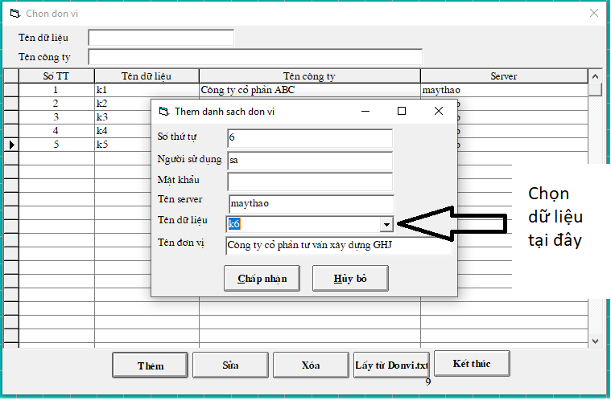
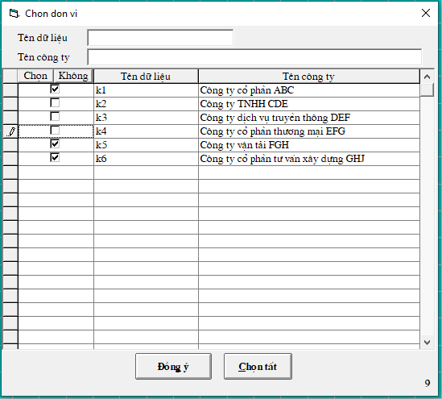

# Cài đặt cây dữ liệu hợp nhất

## Vào dữ liệu công ty mẹ để thực hiện báo cáo hợp nhất.

## Bước 1: Thay đổi tham số trong hệ thống 

Vào **Hệ thống** -&gt; 7. **Thay đổi các tham số** -&gt; pass: khong mot

Tại ô Diễn giải cần tìm gõ chữ "hợp nhất" rồi bấm Enter, sẽ hiện ra bảng như sau:

Tại dòng **"Có hợp nhất dữ liệu"** đổi ở cột **Giá trị** thành **TRUE**

Tại dòng **"Bảng chọn đơn vị khi hợp nhất dữ liệu..."** đổi ở cột **Giá trị** thành **2**

Sau đó bấm **THOÁT** và thoát hẳn phần mềm ra đăng nhập lại

## Bước 2: Từ điển đơn vị hợp nhất dữ liệu

Vào **Hệ thống** -&gt; **Từ điển hệ thống** -&gt; **Từ điển đơn vị khi hợp nhất dữ liệu**

Bấm **Thêm -&gt;** điền **Số thứ tự -&gt;** chọn **Tên dữ liệu** muốn hợp nhất -&gt; bấm **Chấp nhận**

_**\*Lưu ý: dữ liệu kế toán có thể nằm tập trung tại 1 máy chủ, hoặc nhiều máy chủ khác nhau.**_

## Bước 3: In báo cáo hợp nhất

Vào **In báo cáo,** chọn in bất kỳ báo cáo nào tại dữ liệu công ty mẹ, sẽ đều hiện ra các nút tích **Hợp nhất báo cáo** và **Hiện bảng chọn đơn vị**

Để in báo cáo hợp nhất, ta tích vào ô **Hợp nhất báo cáo** -&gt; bấm **Thực hiện** để in, sẽ hiện ra bảng chọn các đơn vị muốn hợp nhất, muốn in báo cáo hợp nhất của những đơn vị nào thì tích vào đơn vị đó.

