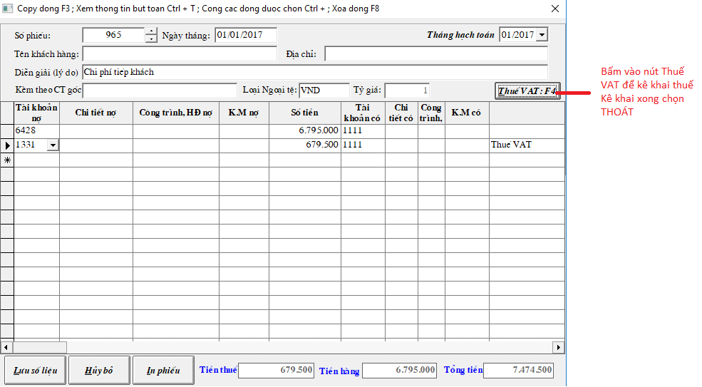
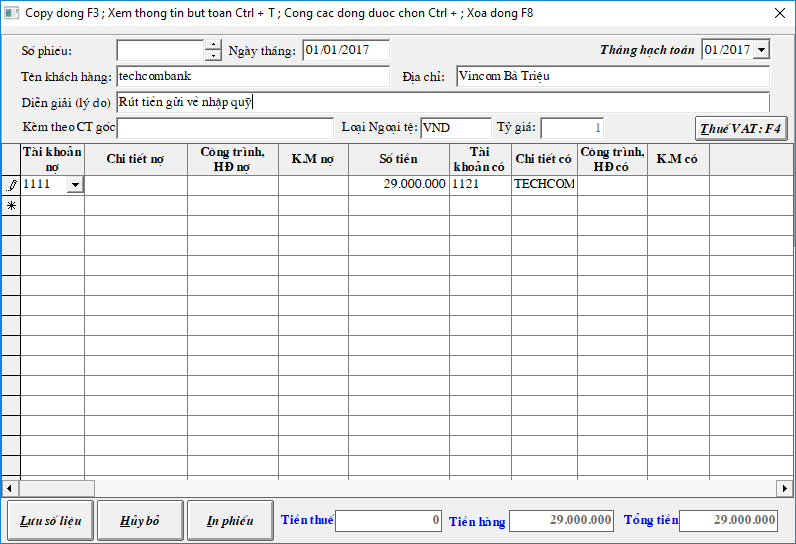
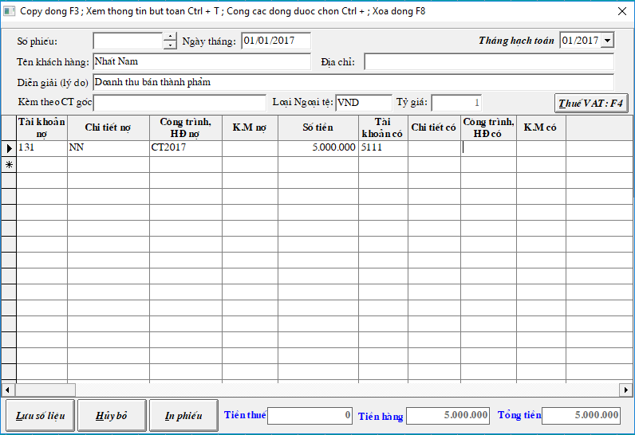

# Nhập chứng từ kế toán

Vào **Menu Chứng từ -&gt; Chứng từ kế toán. -&gt; chọn loại chứng từ -&gt; chọn tháng năm hạch toán -&gt; Tạo Mới**

Các Loại chứng từ:

## **Phiếu chi tiền mặt, Phiếu thu tiền mặt**

-&gt; Liên quan đến tài khoản tiền mặt 111, ví dụ: hạch toán phiếu chi tiền mặt - hóa đơn ăn uống tiếp khách. Sau khi hạch toán xong bút toán ghi có 1111, bấm vào nút THUẾ VAT để kê khai thuế -&gt; chương trình sẽ tự cho ra dòng hạch toán thuế ghi nợ 1331/có 1111.

## **Giấy báo có ngân hàng, Giấy báo nợ ngân hàng**

-&gt; Liên quan đến tài khoản ngân hàng 112, ví dụ: hạch toán giấy báo nợ ngân hàng - rút tiền mặt về nhập quỹ.

## **Chứng từ khác**

-&gt; Liên quan đến các tài khoản còn lại như 131,141,331,511..., ví dụ: bút toán ghi nhận doanh thu.

