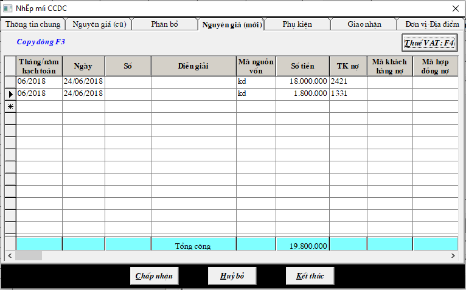

# Nhập Công cụ dụng cụ

## CÔNG CỤ DỤNG CỤ

Vào CHỨNG TỪ -&gt; HỒ SƠ CÔNG CỤ DỤNG, CHI PHÍ TRẢ TRƯỚC -&gt; THÊM CCDC

**Đối với CCDC mới. Nhập vào 3 tab: THÔNG TIN CHUNG, PHÂN BỔ, NGUYÊN GIÁ \(mới\)**

### **a. Tab Thông tin chung:** điền những thông tin về công cụ.

_Lưu ý: Thời gian phân bổ CCDC là theo tháng, và phải tự nhập trực tiếp số tháng vào._

### **b. Tab Phân bổ:** điền thời gian bắt đầu tính phân bổ, tài khoản chi phí là 2421 hoặc 2422, và tài khoản phân bổ khấu hao

Ở tab PHÂN BỔ có 2 cách hạch toán CCDC

* Cách 1: nhập kho CCDC: hạch toán vào tk CCDC 153, sau đó phân bổ chi phí qua chi phí trả trước 2421 hoặc 2422
* Cách 2: không nhập kho CCDC, bỏ trống ô tk CCDC, hạch toán thẳng phân bổ chi phí qua chi phí 2421 hoặc 2422 mà không cần qua tk 153. Và ở tab TĂNG GIẢM sẽ ghi nợ 242 có 1111

### **c. Tab Nguyên giá\(mới\):** hạch toán hóa đơn mua bán CCDC, tài khoản nợ là tài khoản chi phí, tài khoản có là 1111/331/141...

Nếu có Thuế vat hạch toán thêm dòng thuế ghi nợ 1331 có 1111/331/141...-&gt; **sau đó** bấm vào nút THUẾ VAT ở góc phải phiếu nhập để kê thai thuế.

## **Đối với CCDC cũ \(đã có hao mòn\).** 

**Nhập vào 3 tab: THÔNG TIN CHUNG, NGUYÊN GIÁ\(cũ\), KHẤU HAO.**

**a. Tab Thông tin chung:** điền những thông tin về công cụ. \(điền như hình 1\)

**b. Tab Nguyên giá:** điền giá trị ban đầu của công cụ.

**c. Tab Khấu hao:** điền thời gian bắt đầu tính phân bổ, tài khoản chi phí, và tài khoản phân bổ chi phí. \(điền như hình 2\)

**d. Nhập số đã bị phân bổ** vào CHỨNG TỪ -&gt; ĐIỀU CHỈNH CÁC THAY ĐỔI CCDC, chi phí trả trước -&gt; PHÂN BỔ LŨY KẾ ĐẦU NĂM -&gt; nhập giá trị đã phân bổ vào cột PHÂN BỔ LŨY KẾ

### \*\*\*\*

