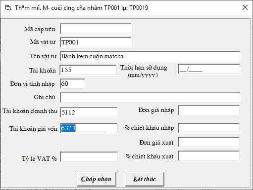
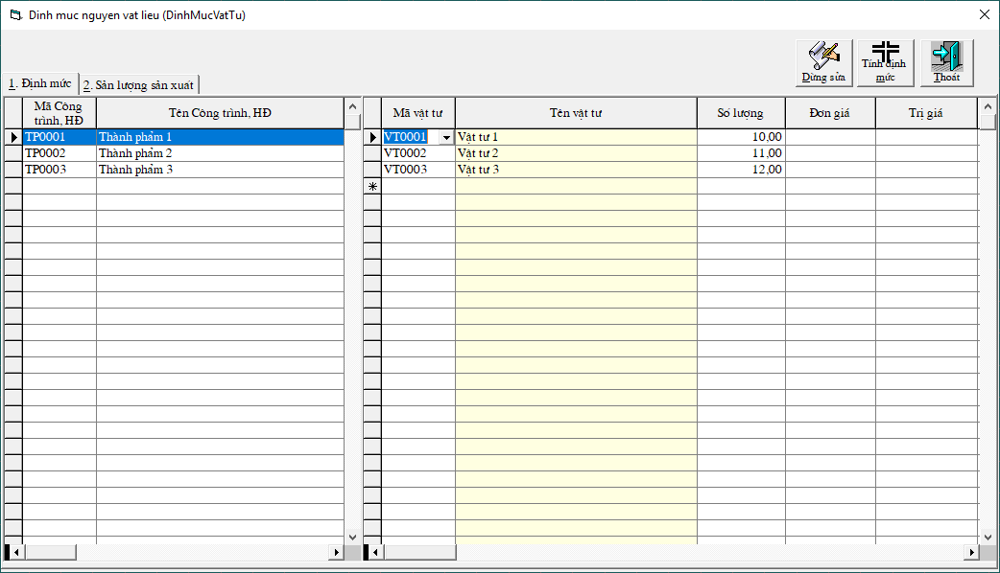
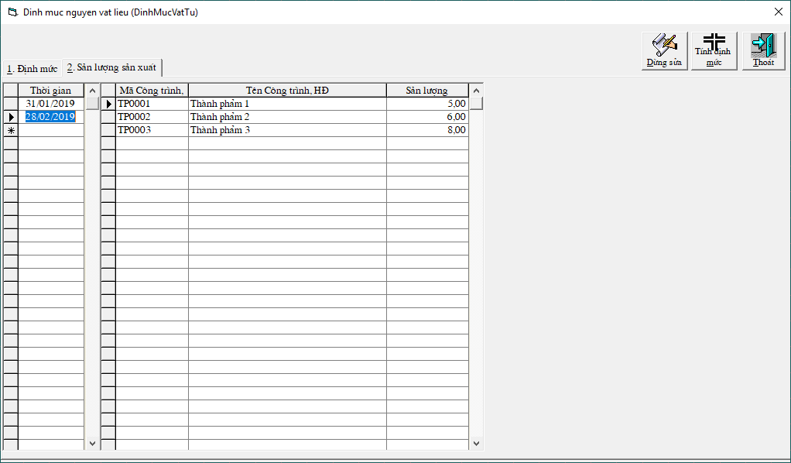
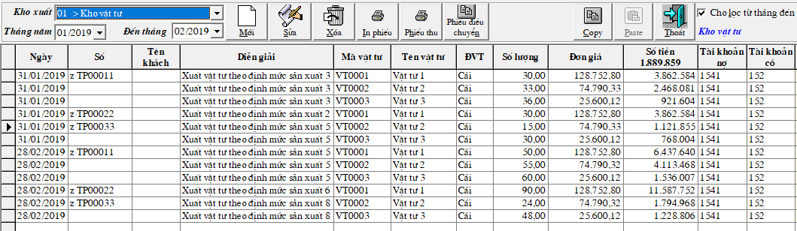
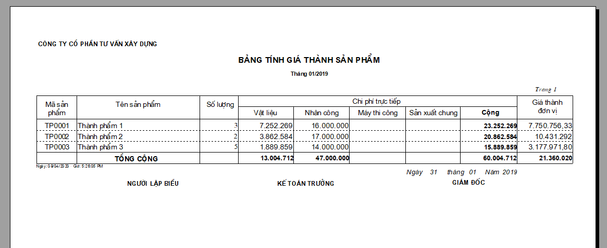
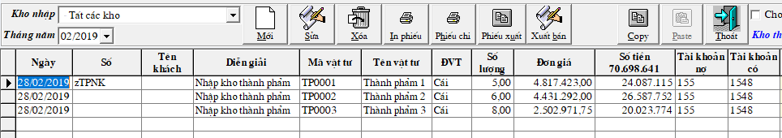

# Nhập định mức nguyên vật liệu cho đơn vị sản xuất theo TT133

## B­ước 1: Thay đổi tham số

Vào Hệ thống -&gt; Thay đổi tham số -&gt; pass: khong mot -&gt; search những tham số sau:

| Tại ô diễn giải cần tìm -&gt; SEARCH -&gt; bấm enter | Thay đôi cột GIÁ TRỊ |
| :--- | :--- |
| Loại giá thành | Điền số 3 |
| Quan hệ giữa mã vật tư và mã sản phẩm | Điền số 3  |

## **Bước 2: Tạo tài khoản 1548 - Tập hợp chi phí xây dựng**

* Vào menu **Hệ thống** -&gt; **Từ điển hệ thống** -&gt; **Từ điển tài khoản** -&gt; Bấm **THÊM** 
* Thêm tài khoản **1548 - Tổng hợp chi phí xây dựng**
* Tích vào ô **Có mở chi tiết** và theo dõi **a. Có công trình, hợp đồng không có công nợ.**

## Bước 3: Tạo mã các thành phẩm

* Vào menu **Hệ thống** -&gt; **Từ điển hệ thống** -&gt; **Từ điển vật tư** -&gt; Bấm **THÊM** 
* Khai báo các mã thành phẩm, ghi **tài khoản 155**, ghi **tài khoản doanh thu thành phẩm 5112** và **giá vốn thành phẩm 6323** \(tự mở thêm tài khoản chi tiết này\) .

## **Bước 3: Nhập định mức**

* Vào menu **Số dư** -&gt; **Định mức nguyên vật liệu và sản lượng sx** -&gt;bấm **SỬA**

### 3.1 Tab 1. **ĐỊNH MỨC**

* Chọn thành phẩm, thêm các vật tư cần để sản xuất thành phẩm ở phần khung bên cạnh
* Đơn giá và trị giá sau khi tính toán sẽ tự nhảy ra, ở đây chỉ cần điền số lượng.

### 3.2 Tab 2. Sản l­ượng sản xuất 

* Điền thời gian sản xuất thành phẩm, Ví dụ: 31/01/2019 rồi bấm ENTER
* Cuối tháng 1 mới làm phiếu xuất, thì điền thời gian là 31/01/2019 sau khi ấn enter -&gt; các mã thành phẩm sẽ hiện ra ở khung bên kia, và điền sản lượng dự tính vào cột sản lượng.

Chọn nút **TÍNH ĐỊNH MỨC**. Chọn khoảng thời gian để tính.

## **Bước 4:** Phiếu xuất vật tư vào sản xuất

Sau đó vào menu **TÍNH TOÁN -&gt; TÍNH SỐ DƯ CUỐI THÁNG** -&gt; Tính toán thời gian vừa tính trong định mức

Chương trình sẽ **tự động tạo** ra **Phiếu xuất tư vào sản xuất** dựa trên **định mức** ứng với từng công trình thành phẩm

## **Bước 5: Kết chuyển công trình** 

* Vào menu **TÍNH TOÁN** -&gt; **KẾT CHUYỂN CÔNG TRÌNH, HỢP ĐỒNG, SẢN PHẨM** **-&gt; Sửa tài khoản**
* Đặt kết chuyển tự động cho các tài khoản **1541,1542,1543,1544** kết chuyển sang **1548**

## **Bước 6:** In bảng tính giá thành

* Vào menu **IN BÁO CÁO -&gt; GIÁ THÀNH SẢN PHẨM SẢN XUẤT -&gt; BẢNG TÍNH GIÁ THÀNH SẢN XUẤT**
* Tích vào ô **TẠO PHIẾU NHẬP KHO THÀNH PHẨM** \(nếu muốn nhập kho thành phẩm tự động\), bấm **IN BÁO CÁO**

_**\*Lưu ý: Phiếu nhập kho thành phẩm sẽ được tạo theo ngày/tháng/năm cuối cùng in báo cáo.  
Ví dụ: In báo cáo từ tháng 01/2019 đến 01/2019, phiếu nhập sẽ tạo vào 31/01/2019  
Còn in báo cáo từ tháng 01/2019 đến 02/2019, phiếu nhập của tháng 1 sẽ bị xóa và gộp vào phiếu ngày 28/02/2019**_ 

#### **VỀ PHIẾU NHẬP KHO THÀNH PHẨM**

Vào menu **Chứng từ -&gt; Phiếu nhập vật tư hàng hóa, thành phẩm** -&gt; chọn kho **Thành phẩm**

Muốn xuất bán luôn các phiếu nhập này, chọn nút _XUẤT BÁN_ -&gt; chương trình sẽ cho ra 1 phiếu xuất bán hết số lượng thành phẩm đã nhập -&gt; Lưu số liệu.

Sau khi xuất bán, phần mềm sẽ tự động tạo phiếu XUẤT GIÁ VỐN ghi có 155/nợ 6323.

