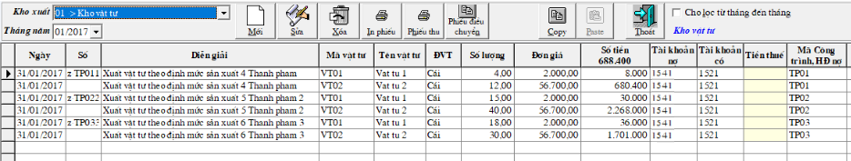
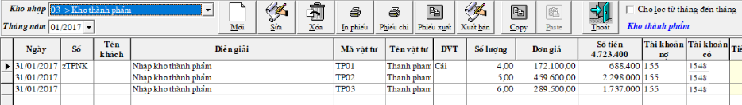

# Nhập định mức nguyên vật liệu cho đơn vị sản xuất theo TT133

Thay đổi tham số trong phần mềm: Khách hàng gọi cho các nhân viên hỗ trợ phần việc này.

Sau khi đã thay đổi tham số, quý khách thực hiện theo các bước sau:

**Bước 1:**

* Vào menu Hệ thống -&gt; từ điển hệ thống -&gt; từ điển tài khoản -&gt; Bấm THÊM -&gt; thêm tài khoản 1548 - Tổng hợp chi phí xây dựng, có mở chi tiết và theo dõi a. Có công trình, hợp đồng không có công nợ.

* Vào menu Hệ thống -&gt; từ điển hệ thống -&gt; từ điển vật tư -&gt; khai báo các mã thành phẩm, ghi tài khoản 155, ghi tài khoản doanh thu thành phẩm 5112 và giá vốn thành phẩm 6323 \(tự mở thêm tài khoản chi tiết này\) .

**Bước 2:** Vào menu Số dư -&gt; Định mức nguyên vật liệu và sản lượng sx -&gt;bấm SỬA

**2.1.** Ở tab 1. ĐỊNH MỨC, chọn thành phẩm, thêm các vật tư cần để sản xuất thành phẩm ở phần khung bên cạnh

Đã có Phiếu nhập vật tư rồi thì phần đơn giá và trị giá sau khi tính toán sẽ tự nhảy ra, ở đây chỉ cần điền số lượng.

**2.2.** Ở tab 2. sản l­ượng sản xuất -&gt; điền thời gian xuất thành phẩm, vật tư;

Ví dụ cuối tháng 1 mới làm phiếu xuất, thì điền thời gian là 31/01/2017 ấn enter -&gt; các mã thành phẩm sẽ hiện ra ở khung bên kia, và điền sản lượng dự tính vào cột sản lượng.

Chọn nút TÍNH ĐỊNH MỨC. Tính trong 1 tháng \(hoặc tùy thời gian xuất của các đơn vị\)

**Bước 3:** Sau đó vào menu TÍNH TOÁN -&gt; TÍNH SỐ DƯ CUỐI THÁNG -&gt; Tính toán thời gian vừa tính trong định mức

Chương trình sẽ tự động tạo ra Phiếu xuất tư vào sản xuất dựa trên định mức ứng với từng công trình thành phẩm

**Bước 4:** Vào menu TÍNH TOÁN -&gt; KẾT CHUYỂN CÔNG TRÌNH, HỢP ĐỒNG, SẢN PHẨM -&gt; chọn từ tháng đến tháng -&gt; kết chuyển có 1541,1542,1543,1544 sang nợ 1548 \(bước này có máy là tự động\)

**Bước 5:** Vào menu IN BÁO CÁO -&gt; GIÁ THÀNH SẢN PHẨM SẢN XUẤT -&gt; BẢNG TÍNH GIÁ THÀNH SẢN XUẤT

Tích vào ô TẠO PHIẾU NHẬP KHO THÀNH PHẨM \(nếu muốn nhập kho thành phẩm tự động\), bấm IN BÁO CÁO

**Lưu ý:** Đối với các mục Nhân công, máy thi công, sản xuất chung -&gt; phải nhập trực tiếp theo từng công trình sản phẩm. Vào chứng từ -&gt; Chứng từ kế toán -&gt; chọn loại chứng từ KHÁC để hạch toán -&gt; nhập xong TÍNH SỐ DƯ CUỐI THÁNG số liệu sẽ nhảy vào bảng TÍNH GIÁ THÀNH SẢN PHẨM này.

**VỀ PHIẾU NHẬP KHO THÀNH PHẨM**

Vào menu chứng từ -&gt; phiếu nhập vật tư hàng hóa, thành phẩm -&gt; chọn kho Thành phẩm

Muốn xuất bán luôn các phiếu nhập này, chọn nút XUẤT BÁN -&gt; chương trình sẽ cho ra 1 phiếu xuất bán hết số lượng thành phẩm đã nhập -&gt; Lưu số liệu.

Sau khi xuất bán, phần mềm sẽ tự động tạo phiếu XUẤT GIÁ VỐN ghi có 155/nợ 6323.

