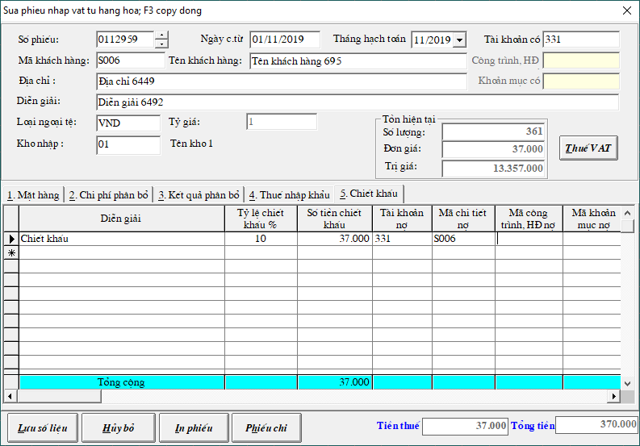
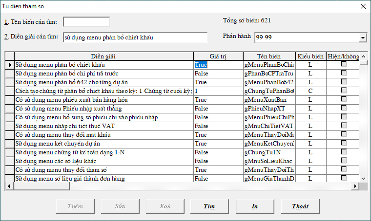
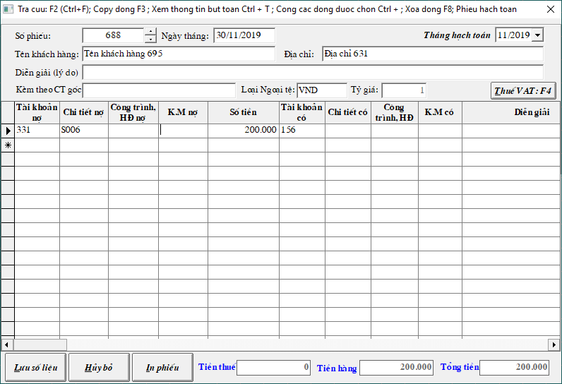
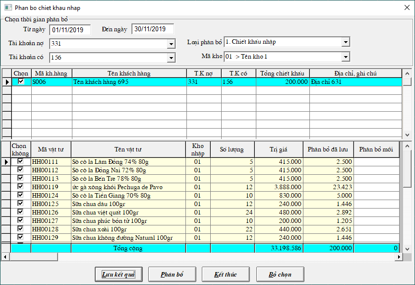
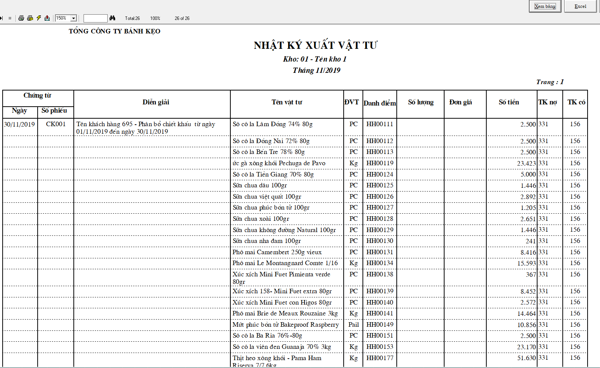

# Nhập phân bổ chiết khấu mua hàng

Có 2 trường hợp chiết khấu khi mua hàng:

## Trường hợp 1: Chiết khấu trực tiếp với hóa đơn tại thời điểm mua.

Vào **Chứng từ** -&gt; **Phiếu Nhập vật tư, hàng hóa, thành phẩm** -&gt; Chọn **kho** -&gt; **Tạo Mới**

Sau khi nhập các mặt hàng vào tab 1. Mặt hàng 

Ta chọn tiếp sang **tab 5. Chiết khấu: Điền các thông số cần thiết và bấm Lưu số liệu là xong.**

Chương trình sẽ tự động phân bổ chiết khấu cho từng mặt hàng có trong hóa đơn này.

## Trường hợp 2: Chiết khấu khi tổng giá trị mua hàng đạt đến hạn mức.

### Bước 1: Thay đổi tham số phần mềm

Vào **Hệ thống** -&gt; **7. Thay đổi tham số** -&gt; pass: **khong mot** -&gt; điền vào diễn giải cần tìm là "**sử dụng menu phân bổ chiết khấu**" -&gt; thay **FASLE** ở cột giá trị thành **TRUE**

### **Bước 2: Hạch toán hóa đơn chiết khấu**

Vào **Chứng từ** -&gt; **Chứng từ kế toán** -&gt; ****Chọn **Phiếu khác**

Hạch toán ghi **Nợ** 331/1111 **Có** 156

### **Bước 3: Phân bổ chiết khấu cho từng mặt hàng**

Vào menu **Tính toán** -&gt; **4. Phân bổ chiết khấu nhập hàng** 

**Chọn từ ngày đến ngày phân bổ; Chọn Mã kho nhập**

Kiểm tra đúng đủ các thông tin + mặt hàng.

Bấm **PHÂN BỔ** -&gt; **LƯU KẾT QUẢ** -&gt; **KẾT THÚC**

### Bước 4: Xem số liệu đã được phân bổ

Vào menu **In báo cáo** -&gt; **2. Vật tư** -&gt; **3. Nhật ký xuất vật tư** -&gt; Chọn **thời gian in** -&gt; bấm vào nút **ĐỐI TƯỢNG** để chọn đối tượng khách hàng muốn in -&gt; Bấm **In báo cáo**

**Số tiền phân bổ chiết khấu sẽ được trừ thẳng vào đơn giá vốn xuất**

