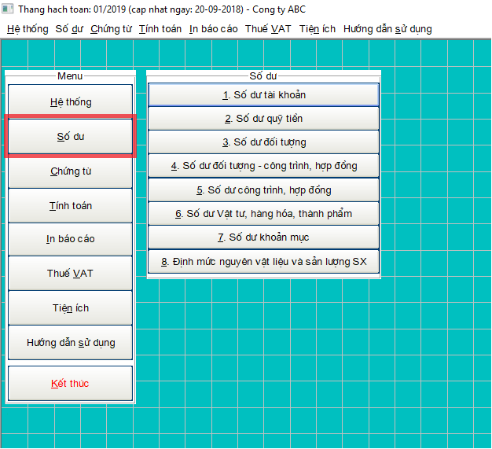
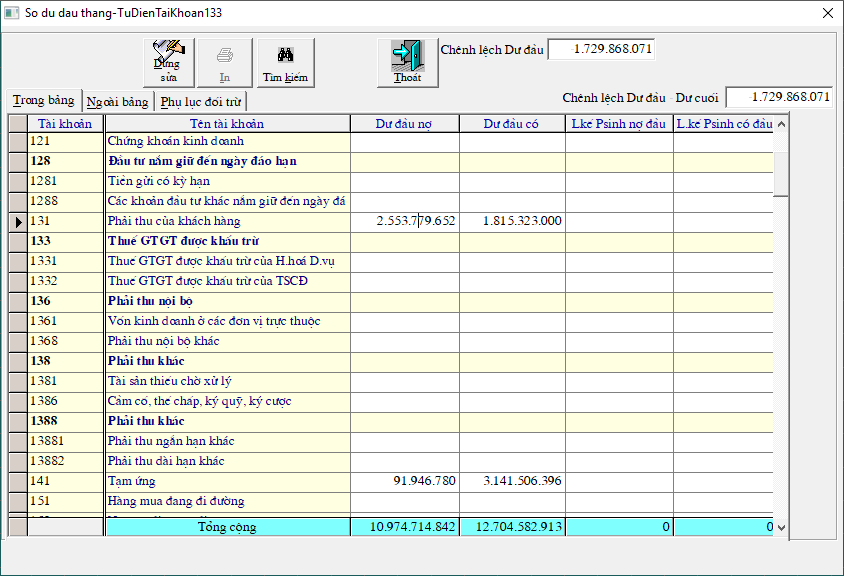
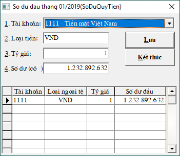
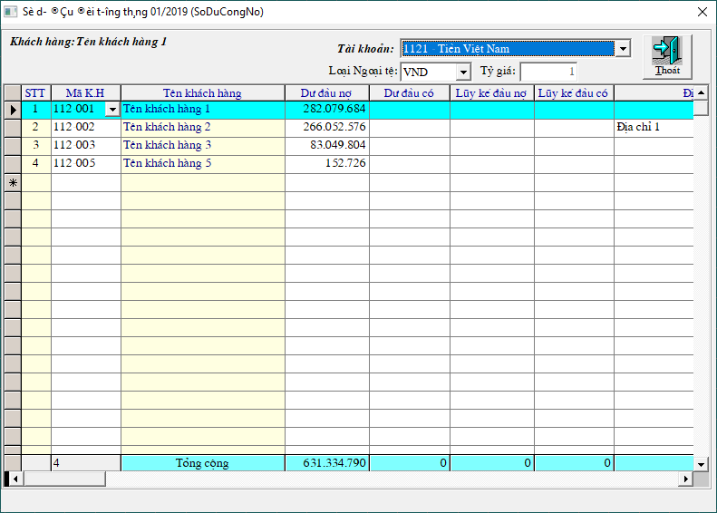

# Nhập số dư đầu

## Menu **Số dư**:

### 1. Số dư tài khoản: 

Để nhập các tài khoản không theo dõi chi tiết, ví dụ: 411, 242, 133, 333...

Bấm **SỬA** -&gt; nhập số tiền vào cột dư đầu  -&gt; bấm **Enter** để nhảy số tiền ở dòng **Tổng cộng** phía dưới

Trong trường hợp đã nhập xong hết số dư của các tài khoản theo dõi công nợ, công trình, hay vật tư, hàng hóa, ta vào menu **SỐ DƯ** -&gt; **1.SỐ DƯ TÀI KHOẢN** -&gt; chương trình hỏi **CÓ LẤY SỐ DƯ TỪ CHI TIẾT LÊN KHÔNG?** -&gt; chọn **CÓ**, ****để số dư của các tài khoản theo dõi chi tiết nhảy vào bảng.

### 2. Số dư quỹ tiền: 

Đê nhập số dư của tài khoản 111 vào ô **4. Số dư\(- có\)** -&gt; nhập số tiền -&gt; bấm **Lưu** -&gt; **Kết thúc**

### 3. Số dư đối tượng:

 Để nhập những tài khoản có theo dõi đối tượng khách hàng ví dụ: 1121, 331... 

* Chọn tài khoản \(Ví dụ tài khoản đang được chọn để nhập là 1121 \)
* Bấm nút  để chọn mã công nợ
* Nhập số tiền vào cột Dư đầu -&gt; rồi bấm **Enter** để lưu số tiền

Lưu ý: Trong trường hợp chưa có mã công nợ nào, ta vẫn b

1. Số dư đối tương - công trình, hợp đồng: nhập những tài khoản theo dõi cả đối tượng và công trình, ví dụ: 131, 141...
2. Số dư công trình, hợp đồng: nhập những tài khoản theo dõi công trình, ví dụ: 154,..

**Lưu ý:** Nếu là dữ liệu mới, chưa có các mã công nợ, công trình. Trước khi nhập số dư phải tạo mã cho các công nợ và công trình:

Chọn menu Hệ Thống -&gt; Từ điển hệ thống -&gt; Từ điển công nợ : để nhập mã công nợ

Chọn menu Hệ Thống -&gt; Từ điển hệ thống -&gt; Từ điển công trình, hợp đồng : để nhập mã công trình, hợp đồng

