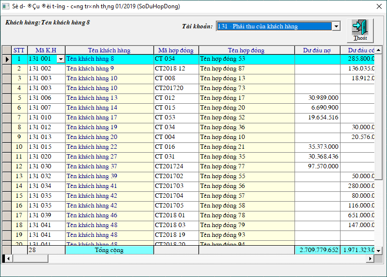
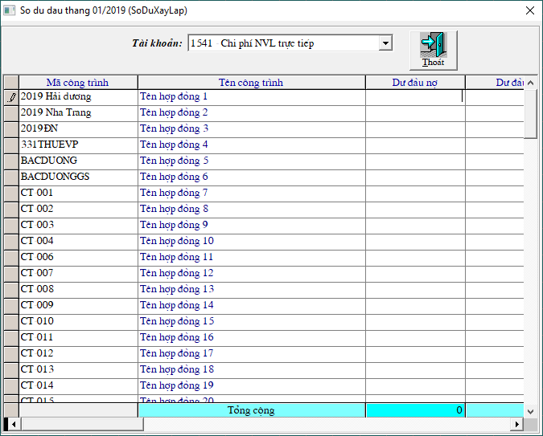
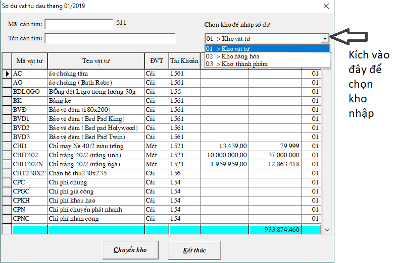

# Nhập số dư đầu

## Menu **Số dư**:

Gợi ý nhập

| Tài khoản | Nơi nhập |
| :--- | :--- |
| 411, 242, 133, 333... | 1. SỐ DƯ TÀI KHOẢN |
| 1111, 1112, 1113... | 2. SỐ DƯ QUỸ TIỀN |
| 1121, 331, 334... \(tài khoản theo dõi công nợ\) | 3. Số dư đối tượng |
| 131, 141, ....\(tài khoản theo dõi cả công nợ và công trình\) | 4. Số dư đối tượng - công trình |
| 154 \(tài khoản theo dõi công trình, hợp đồng\) | 5. Sô dư công trình, hợp đồng |
| 156, 152 | 6. Số dư vật tư, hàng hóa, thành phẩm |

### 1. Số dư tài khoản: 

Để nhập các tài khoản không theo dõi chi tiết, ví dụ: 411, 242, 133, 333...

Bấm **SỬA** -&gt; nhập số tiền vào cột dư đầu  -&gt; bấm **Enter** để nhảy số tiền ở dòng **Tổng cộng** phía dưới

Trong trường hợp đã nhập xong hết số dư của các tài khoản theo dõi công nợ, công trình, hay vật tư, hàng hóa, ta vào menu **SỐ DƯ** -&gt; **1.SỐ DƯ TÀI KHOẢN** -&gt; chương trình hỏi **CÓ LẤY SỐ DƯ TỪ CHI TIẾT LÊN KHÔNG?** -&gt; chọn **CÓ**, ****để số dư của các tài khoản theo dõi chi tiết nhảy vào bảng.

### 2. Số dư quỹ tiền: 

Đê nhập số dư của tài khoản 111 vào ô **4. Số dư\(- có\)** -&gt; nhập số tiền -&gt; bấm **Lưu** -&gt; **Kết thúc**

### 3. Số dư đối tượng:

 Để nhập những tài khoản có theo dõi đối tượng khách hàng ví dụ: 1121, 331... 

* Chọn tài khoản \(Ví dụ tài khoản đang được chọn để nhập là 1121 \)
* Bấm nút  để chọn mã công nợ
* Nhập số tiền vào cột Dư đầu -&gt; rồi bấm **Enter** để lưu số tiền

_**Lưu ý:** Trong trường hợp chưa có mã công nợ nào, ta vẫn bấm vào nút_  _ở cột Mã K.H để tạo mã khách hàng. Vào link này để xem cách tạo mã công nợ khách hàng_ [_https://docs.phanmemnhatnam.com/huong-dan-su-dung-1/nhap-tu-dien-he-thong_](https://docs.phanmemnhatnam.com/huong-dan-su-dung-1/nhap-tu-dien-he-thong)\_\_

### 4. Số dư đối tương - công trình, hợp đồng: 

Để nhập những tài khoản theo dõi cả **công nợ khách hàng** lẫn **công trình hợp đồng**, ví dụ: 131, 141...

* Chọn tài khoản \(Ví dụ tài khoản đang được chọn để nhập là 131 \)
* Bấm nút  ở cột **Mã K.H** để chọn mã công nợ
* Bấm nút  ở cột **Mã hợp đồng** để chọn mã công trình
* Nhập số tiền vào cột Dư đầu -&gt; rồi bấm **Enter** để lưu số tiền

_**Lưu ý:** Trong trường hợp chưa có mã công nợ , công trình nào, ta vẫn bấm vào nút_  _ở cột Mã K.H và cột Mã hợp đồng để tạo mã . Vào link này để xem cách tạo_ [_https://docs.phanmemnhatnam.com/huong-dan-su-dung-1/nhap-tu-dien-he-thong_](https://docs.phanmemnhatnam.com/huong-dan-su-dung-1/nhap-tu-dien-he-thong)\_\_

### 5. Số dư công trình, hợp đồng: 

Để nhập những tài khoản theo dõi công trình, ví dụ: 154

* Bấm nút  ở cột **Mã công trình** để chọn mã công trình
* Nhập số tiền vào cột Dư đầu -&gt; rồi bấm **Enter** để lưu số tiền

### **6. Số dư vật tư, hàng hóa, thành phẩm:**

_**Lưu ý:** Trước khi nhập số dư cho vật tư, hàng hóa, ta cần phải có danh sách các mặt hàng._

_Ta vào link sau để xem cách tạo mã vật tư, hàng hóa, thành phẩm trong phần mềm:_ [_https://docs.phanmemnhatnam.com/huong-dan-su-dung-1/nhap-tu-dien-he-thong_](https://docs.phanmemnhatnam.com/huong-dan-su-dung-1/nhap-tu-dien-he-thong)\_\_

* Chọn Kho để nhập số dư: Nhập số dư cho vật tư thì chọn Kho vật tư.
* Nhập số lượng tồn vào cột **S.L ĐẦU**
* Nhập số tiền tồn tổng của vật tư đó vào cột **TIỀN ĐẦU -&gt;** rồi bấm **Enter** để lưu số tiền

### 7. Số dư khoản mục:

Để nhập số dư của các tài khoản theo dõi khoản mục

Ví dụ: tài khoản 1111, 131, 331 hay 154... theo dõi khoản mục cũng nhập số dư đầu vào đây

