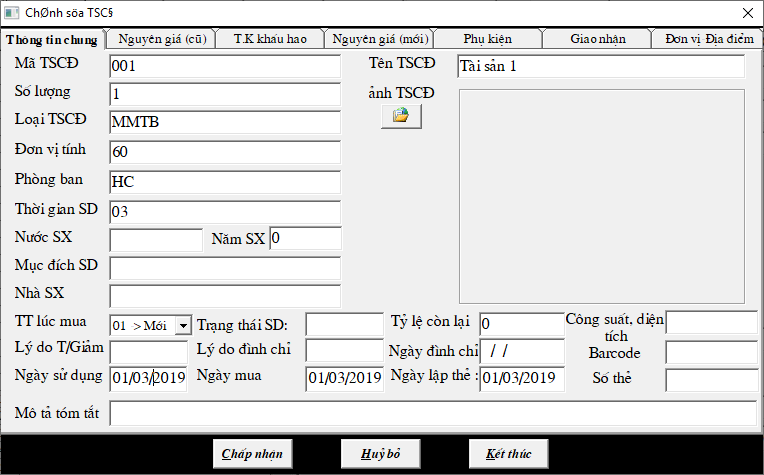
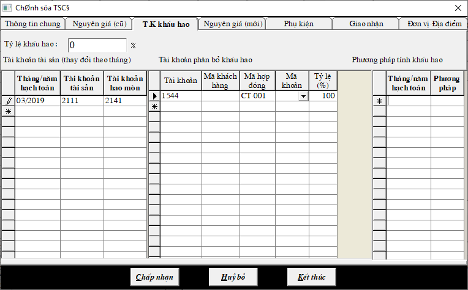
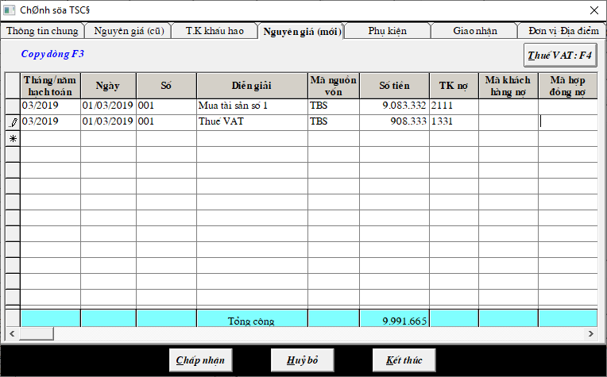

# Nhập Tài sản cố định

## **TÀI SẢN CỐ ĐỊNH**

Vào CHỨNG TỪ -&gt; HỒ SƠ TÀI SẢN CỐ ĐỊNH -&gt; THÊM TSCĐ

### **Đối với TSCĐ mới.** 

**Nhập vào 3 tab: THÔNG TIN CHUNG, KHẤU HAO, TĂNG GIẢM**

**a. Tab Thông tin chung:** điền những thông tin về tài sản.

**b. Tab Khấu hao:** điền thời gian bắt đầu tính khấu hao, tài khoản tài sản 211, tài khoản hao mòn 214, và tài khoản phân bổ khấu hao 154/642/623...

**c. Tab Tăng giảm:** hạch toán hóa đơn mua bán tài sản cố định, tài khoản nợ là tài khoản tài sản 211, tài khoản có là 1111/331

nếu có Thuế vat hạch toán thêm dòng thuế ghi nợ 1331 có 1111/331-&gt; bấm vào nút THUẾ VAT ở góc phải phiếu nhập để kê thai thuế.

### **Đối với TSCĐ cũ \(đã có hao mòn\).** 

**Nhập vào 3 tab: THÔNG TIN CHUNG, NGUYÊN GIÁ, KHẤU HAO.**

**a. Tab Thông tin chung:** điền những thông tin về tài sản. \(điền như hình 1\)

**b. Tab Nguyên giá:** điền giá trị ban đầu của tài sản.

**c. Tab Khấu hao:** điền thời gian bắt đầu tính khấu hao, tài khoản tài sản, tài khoản hao mòn, và tài khoản phân bổ khấu hao. \(điền như hình 2\)

**d. Nhập số đã bị hào mòn** vào CHỨNG TỪ -&gt; ĐIỀU CHỈNH CÁC THAY ĐỔI TSCĐ -&gt; HAO MÒN LŨY KẾ ĐẦU NĂM -&gt; nhập giá trị hao mòn vào cột HAO MÒN LŨY KẾ

### \*\*\*\*

