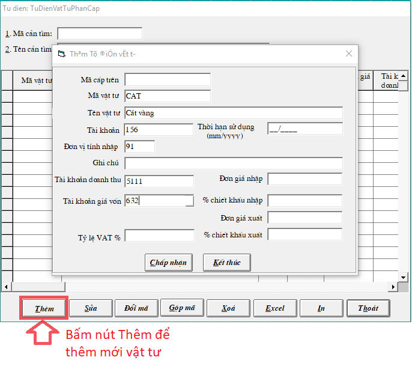

# Nhập các bảng từ điển trong hệ thống

Để chọn các bảng từ điển trong hệ thống ta vào **HỆ THỐNG -&gt; TỪ ĐIỂN HỆ THỐNG**

## **Từ điển công nợ**

**Hệ thống -&gt; Từ điển hệ thống -&gt; Từ điển công nợ -&gt; Bấm THÊM** 

* Điền mã khách hàng: Viết liền không dấu
* Điền tên khách hàng: tên của công ty hoặc của một cá nhân
* Điền địa chỉ, Mã số thuế \(nếu có\) 

Sau khi điền xong thông tin bấm **CHẤP NHẬN** để lưu và bấm **KẾT THÚC** để thoát

## Từ điển công trình - hợp đồng

**Hệ thống -&gt; Từ điển hệ thống -&gt; Từ điển công trình - hợp đồng -&gt; Bấm THÊM** 

* Điền mã cấp trên \(nếu có, không bắt buộc\)
* Điền mã công trình: Viết liền không dấu \(mã số của Hợp đồng hoặc tên viết tắt của công trình\)
* Điền tên công trình: tên đầy của công trình, hợp đồng đó

Sau khi điền xong thông tin bấm **CHẤP NHẬN** để lưu và bấm **KẾT THÚC** để thoát

_**Lưu ý:**  ô mã cấp trên chỉ điền khi công trình đó là công trình con của 1 dự án lớn_

## Từ điển vật tư

**Hệ thống -&gt; Từ điển hệ thống -&gt; Từ điển Vật tư -&gt; Bấm THÊM** 

* Điền mã vật tư \(viết liền không dấu\)
* Điền tên vật tư
* Điền tài khoản \(152,156,155,153...\)
* Điền đơn vị tính: ấn vào nút  để chọn theo từ điển có sẵn

_**Lưu ý:** Nếu là **Hàng hóa đem bán** thì điền thêm T**ài khoản doanh thu** là 511, và **Tài khoản giá vốn** là 632_

Sau khi điền xong thông tin bấm **Chấp nhận** để lưu mới vật tư

