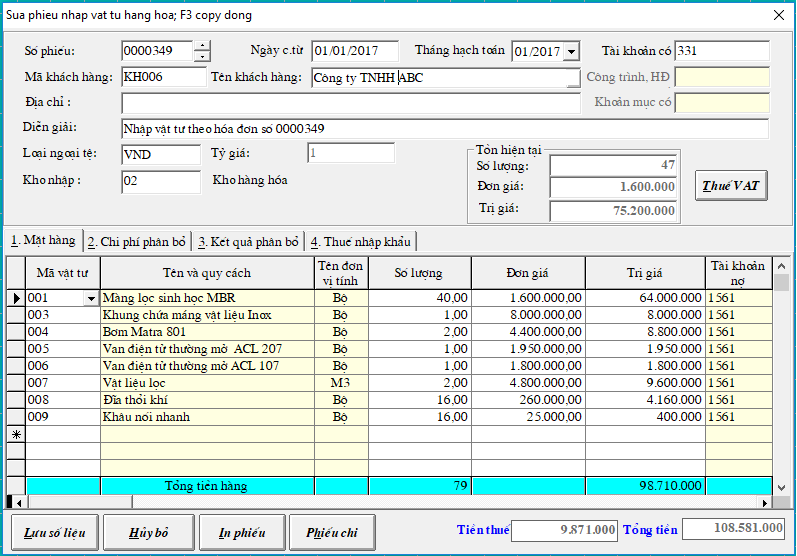
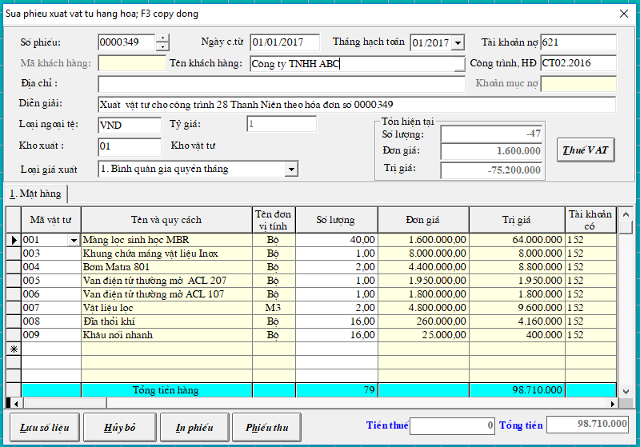

# Nhập - xuất vật tư - hàng hóa

## **Nhập Vật tư - Hàng hóa - Thành phẩm**

**Bước 1:** Vào Chứng từ -&gt; Phiếu nhập Vật tư, hàng hóa, thành phẩm -&gt; chọn kho nhập vào tháng năm hạch toán -&gt; tạo Mới

**Bước 2:** Nhập vào phiếu -&gt; lưu số liệu

_**Lưu ý**_: Khi nhập Hàng hóa vào Từ điển vật tư \(hệ thống -&gt; Từ điển hệ thống -&gt; Từ điển vật tư hoặc ấn nút Chọn ở cột mã vật tư trong Phiếu nhập để thêm vật tư\) đăng ký thêm tài khoản giá vốn 632 và tài khoản doanh thu 511 cho mặt hàng đó.

## **Xuất Vật tư - Hàng hóa - Thành phẩm**

### **Xuất Vật tư**

Vào Chứng từ -&gt; Phiếu xuất vật tư vào sản xuất

### **Xuất bán hàng hóa - thành phẩm**

Vào Chứng từ -&gt; Phiếu xuất bán hàng hóa - thành phẩm

_**Lưu ý:**_ Sau khi nhập phiếu xuất bán hàng hóa ghi bút toán doanh thu Nợ 1111 hoặc 131 / Có 5111

-&gt; chương trình sẽ tự động tạo ra Phiếu xuất giá vốn hàng hóa ghi Nợ 632 / Có 156

