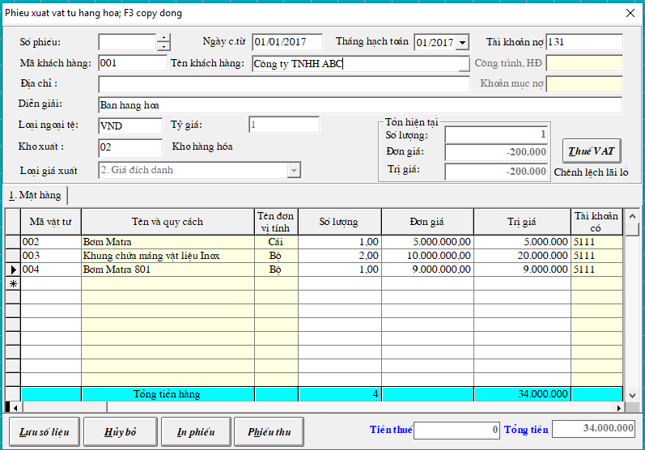

# Nhập - xuất vật tư - hàng hóa

## **Nhập Vật tư - Hàng hóa - Thành phẩm**

### **Bước 1:**

 Vào **Chứng từ** -&gt; **Phiếu nhập Vật tư, hàng hóa, thành phẩm** -&gt; chọn **Kho nhập** -&gt; chọn T**háng năm** hạch toán -&gt; tạo **Mới**

### **Bước 2:** 

* Nhập số phiếu \(_số phiếu có thể tự động tăng_\)
* Nhập ngày chứng từ 
* Nhâp tài khoản có \(331 hoặc 1111\)

| Có 331 | Nhập mã khách hàng và mã hợp đồng \(nếu có\) |
| :--- | :--- |

* Để chọn vật tư muốn nhập, ta tích vào nút  ở dưới cột **Mã vật tư** để thêm vật tư -&gt; nhập số lượng, và đơn giá sẽ tự nhảy ra trị giá.

_**Lưu ý**_: Trong trường hợp chưa có mã vật tư nào, khi ta ấn vào nút  sẽ hiện ra từ điển vật tư -&gt; chọn nút **Thêm** để thêm mới

* Điền Mã vật tư : viết liền, không dấu
* Điền tên vật tư: viết chữ bình thường, có dấu
* Điền tài khoản: Hàng hóa là 156; Nguyên vật liệu là 152
* Điền Đơn vị tính: ấn vào nút  để chọn theo từ điển có sẵn
* _Nếu là **Hàng hóa đem bán** thì điền thêm Tài khoản doanh thu là 511, và tài khoản giá vốn là 632_

Bấm **Chấp nhận** để lưu mới vật tư

## **Xuất Vật tư - Hàng hóa - Thành phẩm**

### **Xuất Vật tư vào sản xuất**

Vào **Chứng từ** -&gt; **Phiếu xuất vật tư vào sản xuất**

* Điền số phiếu + ngày xuất vật tư
* Điền tài khoản nợ theo TT200 là 621, theo TT133 là 1541
* Điền mã công trình, hợp đồng \(vật tư xuất ra công trình nào\)
* Loại giá xuất: tùy chọn hoặc mặc định \(các đơn vị hay dùng là **Bình quân gia quyền tháng**\)
* Tại cột Mã vật tư, bấm nút  để chọn vật tư xuất, **điền số lượng**, sẽ tự nhảy ra đơn giá và trị giá

### **Xuất bán hàng hóa - thành phẩm**

Vào **Chứng từ** -&gt; **Phiếu xuất bán hàng hóa - thành phẩm**

_**Lưu ý:** Sau khi nhập phiếu xuất bán hàng hóa -&gt; chương trình sẽ **tự động** **tạo** ra **Phiếu xuất giá vốn** hàng hóa ghi Nợ 632 / Có 156_

