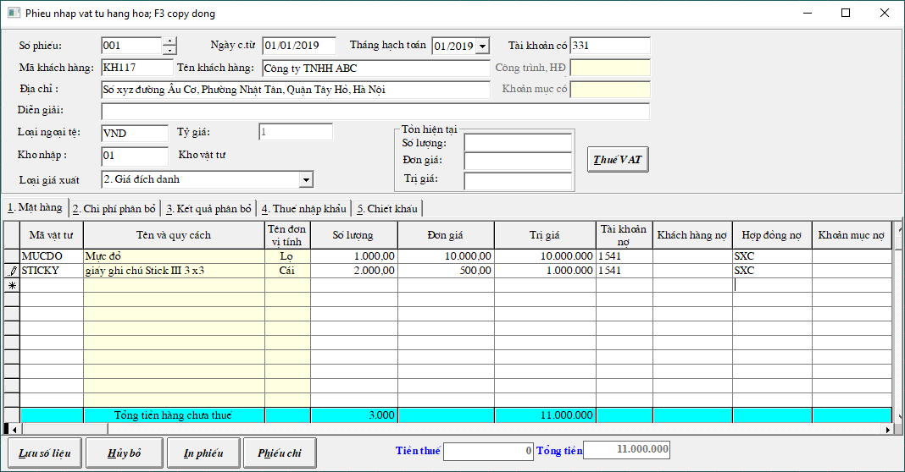

# Phiếu nhập - xuất thẳng vật tư

## Bước 1: Thay đổi tham số

Vào Hệ thống -&gt; Thay đổi tham số -&gt; pass: khong mot -&gt; search những tham số sau:

<table>
  <thead>
    <tr>
      <th style="text-align:left">T&#x1EA1;i &#xF4; di&#x1EC5;n gi&#x1EA3;i c&#x1EA7;n t&#xEC;m -&gt; SEARCH
        -&gt; b&#x1EA5;m enter</th>
      <th style="text-align:left">Thay &#x111;&#xF4;i c&#x1ED9;t GI&#xC1; TR&#x1ECA;</th>
    </tr>
  </thead>
  <tbody>
    <tr>
      <td style="text-align:left">C&#xF3; s&#x1EED; d&#x1EE5;ng menu phi&#x1EBF;u nh&#x1EAD;p xu&#x1EA5;t
        th&#x1EB3;ng</td>
      <td style="text-align:left">False -&gt; True</td>
    </tr>
    <tr>
      <td style="text-align:left">C&#x1ED9;t &#x111;&#x1ED1;i t&#x1B0;&#x1EE3;ng trong phi&#x1EBF;u nh&#x1EAD;p
        xu&#x1EA5;t</td>
      <td style="text-align:left">False -&gt; True</td>
    </tr>
    <tr>
      <td style="text-align:left">Cho s&#x1EED;a t&#xE0;i kho&#x1EA3;n khi xu&#x1EA5;t v&#x1EAD;t t&#x1B0;</td>
      <td
      style="text-align:left">False -&gt; True</td>
    </tr>
    <tr>
      <td style="text-align:left">T&#xE0;i kho&#x1EA3;n v&#x1EAD;t t&#x1B0;</td>
      <td style="text-align:left">
        
Th&#xEA;m t&#xE0;i kho&#x1EA3;n 1541 (Theo TT133),

        
ho&#x1EB7;c 621 (Theo TT200)

      </td>
    </tr>
  </tbody>
</table>## Bước 2: Chứng từ -&gt; Phiếu nhập xuất thẳng vật tư

Vào **Chứng từ** -&gt; **Phiếu nhập - xuất thẳng vật tư** -&gt; Chọn **Kho** \(có thể tạo thêm kho nhập xuất thẳng để phân biệt với các kho khác\) -&gt; bấm **Mới**

* Tài khoản có ghi 331 hoặc 111
* Tài khoản nợ ghi 1541 \(nếu theo TT133\) hoặc 621 \(nếu theo TT200\)

## Bước 3: Xem báo cáo

Vì là Nhập - Xuất thẳng nên khi hạch toán sẽ không đi qua tài khoản 152, 156, 155, 153. 

Mà xuất từ **tài khoản thanh toán** đến thẳng **tài khoản chi phí** là **Có 111,331.. và Nợ 1541,621**

Nên khi xem cân đối nhập - xuất - tồn, ta **Chọn tài khoản** là **1541** hoặc **621 -&gt; Bấm THỰC HIỆN**

\*\*\*\*

