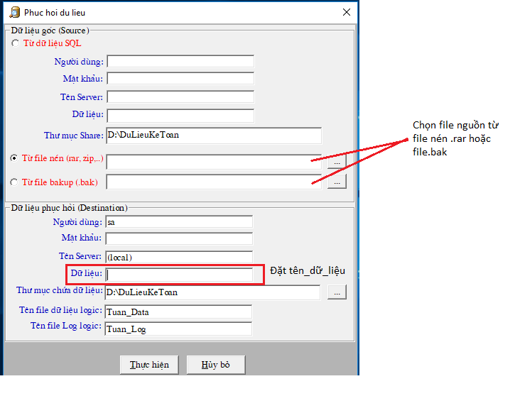

# Tạo dữ liệu mới

### **I. TẠO DỮ LIỆU MỚI:**

* Ta chuột phải vào biểu tượng kế toán ngoài desktop -&gt; chọn open file location -&gt; chọn restore
* Hoặc nếu quý khách thường xuyên phải tạo hay phục hồi dữ liệu thì có thể send to "restore" ra desktop để tiện thao tác
* Kích đúp vào biểu tượng restore -&gt; chọn kiểu tệp

* Sẽ có 2 kiểu định dạng chứa dữ liệu: 1 là kiểu nén file.rar, 2 là kiểu file.bak \(hình ảnh minh họa\). dữ liệu ở định dạng nào thì ta chọn đối chiếu đến đó.
* Thông thường trong bộ cài đặt kế toán chúng tôi có để file ketoan.rar để tạo dữ liệu mới, quý khách chọn ketoan.rar _\(nếu không có file ketoan.rar, tải về theo đường link sau:_ [_https://phanmemnhatnam.com/tai-ve_](https://phanmemnhatnam.com/tai-ve/) _\)_
* Đặt tên cho dữ liệu
* Sau khi ấn thực hiện và hệ thống chạy xong. Ta thoát ra và vào chương trình
* Ta đăng nhập với tên người sử dụng: 99; pass: khong mot \( "khong" dấu cách chữ "mot"\)
* Chọn Thay đổi tên đơn vị -&gt; Sửa -&gt; điền thông tin công ty
* Chọn Từ điển dữ liệu kế toán -&gt; bấm sửa -&gt; lôi dữ liệu ra.
* Nếu dữ liệu theo TT133, vào Hệ thống -&gt; Thay đổi các tham số của hệ thống -&gt; Search ở ô Diễn giải cần tìm là DNN -&gt; Thay giá trị SX ở cột giá trị thành DNN -&gt; thoát

**1.2. Kiểu thứ hai: dữ liệu được lưu trữ trong dưới dạng file gốc .mdf hoặc .data**

* Đối với kiểu dữ liệu gốc lưu ở dạng .mdf, ta vào Enterprise manager

* Chọn \(+\) cho đến khi thấy Databases -&gt; chuột phải -&gt; all Tasks -&gt; Attach Database

* Chọn \[...\] \(bên cạnh nút Verify\) để chọn file nguồn chứa dữ liệu -&gt; chọn các file lưu dưới dạng .mdf hoặc .data -&gt; ok

* Vào Người sử dụng: 99; pass: "khong mot" \( không cách một \) -&gt; để lôi dữ liệu ra \(thao tác giống phần trên\)

