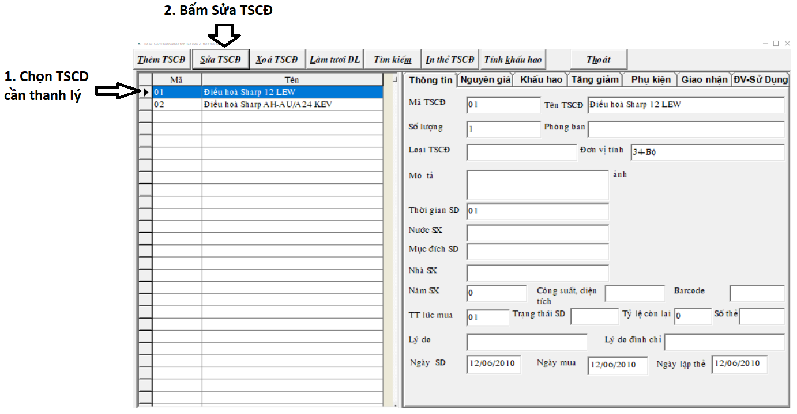
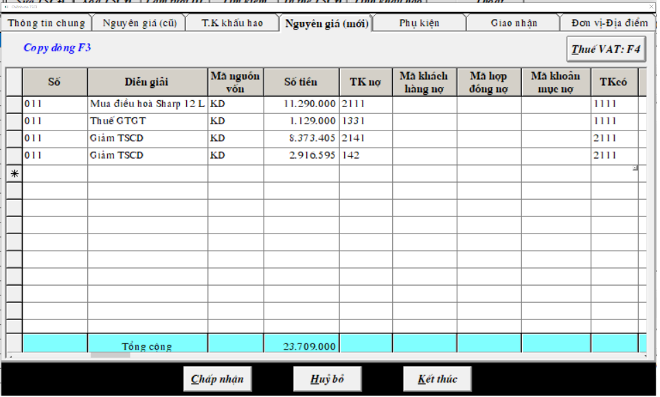

# Thanh lý TSCĐ trên phần mềm kế toán

## Bước 1: Ghi giảm TSCĐ

Khi thanh lý một TSCĐ ta phải ghi giảm TSCĐ đó

Ta vào **Chứng từ** -&gt; **Hồ sơ Tài sản cố định** -&gt; **chọn** TSCD cần thanh lý -&gt; bấm **Sửa TSCĐ**

## **Bước 2: Hạch toán** 

Chọn Tab 4. Nguyên giá\(mới\) -&gt; hạch toán ghi

| nợ 214  có 211 | số tiền hao mòn lũy kế \(số tiền hao mòn của TSCD từ trước đến giờ\) |
| :--- | :--- |
| nợ 811 có 211 | số tiền còn lại của TSCD |

Hai số tiền này cộng lại bằng đúng nguyên giá \(giá trị ban đầu của TSCĐ\)

## Bước 3: Hạch toán thu nhập khác 711

Vào Chứng từ -&gt; chứng từ kế toán -&gt; chọn loại chứng từ:

* Nếu là trả bằng tiền mặt thì chọn Phiếu thu -&gt; hạch toán ghi nợ 1111 có 711 số tiền bán TSCĐ đó
* Nếu trả qua ngân hàng thì chọn Giấy báo có ngân hàng -&gt; hạch toán ghi nợ 1121 có 711
* Nếu trả tiền qua công nợ thì chọn Phiếu khác -&gt; hạch toán ghi nợ 131 có 711

