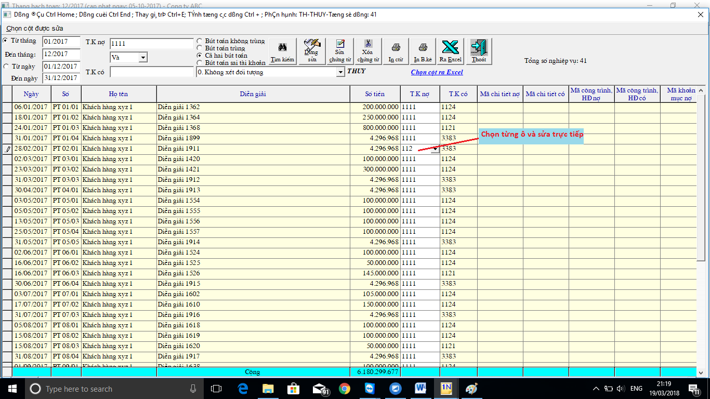

# Chỉnh sửa đồng loạt chứng từ kế toán

## Chỉnh sửa đồng loạt chứng từ kế toán

Bước 1: Vào menu TIỆN ÍCH -&gt; LỌC CHỨNG TỪ KÊ TOÁN -&gt; lọc các bút toàn cần sửa

Bước 2: Bấm nút **SỬA**

Bước 3: **“Chọn cột được sửa”** ở góc trái màn hình -&gt; rồi kích chuột vào 1 ô trong cột đã chọn

3.1: Nếu muốn sửa tất cả các chứng từ đã lọc: bấm Ctrl+E -&gt; điền giá trị thay thế vào ô trống

3.2: Nếu muốn sửa 1 số chứng từ -&gt; bôi xanh các dòng muốn sửa -&gt; Giữ **shift** chọn từ dòng đến dòng hoặc giữ **Ctrl** chọn từng dòng muốn sửa -&gt; bấm Ctrl+E -&gt; điền giá trị thay thế vào ô trống

3.3: Nếu muốn sửa từng dòng chứng từ -&gt; chọn từng ô trong cột đã chọn -&gt; và sửa lại, thao tác như trong excel.

 

