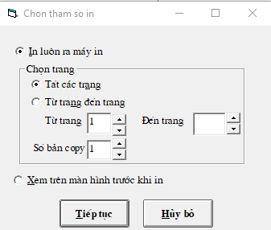

# In một loạt chứng từ kế toán

## Chọn IN đồng loạt chứng từ kế toán \(Phiếu thu, chi, ngân hàng, vật tư...\)

_**Bước 1:**_ Vào menu **CHỨNG TỪ** -&gt; **CHỨNG TỪ KÊ TOÁN** -&gt; Chọn loại phiếu thu, chi ...

_**Bước 2:**_ Chọn Lọc in từ tháng đến tháng -&gt; Bôi xanh các dòng cần in bằng cách: **Giữ Shift** để chọn từ dòng đến dòng, hoặc giữ **Ctrl** để chọn từng dòng muốn in \(giống như trong excel\) 

_**Bước 3:**_ Sau khi các dòng -&gt; Bấm nút **IN PHIẾU** -&gt; Chọn In luôn ra máy in và bấm **TIẾP TỤC**.

