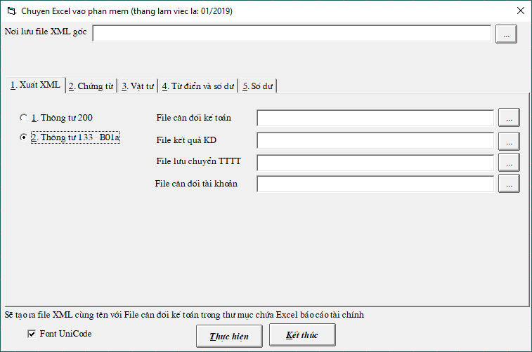

# Lấy Báo cáo tài chính vào HTKK

**Bước 1.** Trước tiên tạo 1 thư mục chứa dữ liệu thuế như Thue200 \(hoặc Thue133\) **tên của thư mục phải viết liền không dấu**

**Bước 2.** Vào HTKK, chọn TT200 \(hoặc TT133-B01a\), **nhớ bỏ dấu tích LCTTGT**

* Bấm nút Kết xuất XML
* Nếu có thông báo lỗi -&gt; Thì nhập số 1 vào dòng tài sản \(1. Tiền\) và số 1 vào 1 dòng nguồn vốn \(- Cổ phiếu phổ thông\)
* Sau đó bấm nút **Kết xuất XML.** Chọn nơi lưu là **thư mục vừa tạo ở bước 1** với tên là TT200.xml \(đây là file nền đã có thông tin doanh nghiệp\). Mỗi công ty đều Kết xuất XML như thế.

**Bước 3.** Chạy phần mềm kế toán -&gt; Vào menu "IN BÁO CÁO" -&gt; chọn "BÁO CÁO TÀI CHÍNH" 

* Chọn nút  để in từng bảng "Cân đối kế toán", "Lưu chuyển tiền tệ", "Kết quả kinh doanh" 
* Bấm vào biểu tượng    \(ghi ra excel\) ở góc trái phía trên màn hình 
* Lưu từng báo cáo vào **thư mục vừa tạo** \(nhớ đặt tên theo từng báo cáo cho dễ nhớ\)

**Bước 4.** Menu “**Tiện ích**” -&gt; “**Xuất XML, chuyển Excel vào phần mềm**”

* Nếu là TT200 chọn ô "**1. Thông tư 200**". Nếu là TT133 thì chọn "**2. Thông tư 133-B01a**"
* Bấm vào  để chọn file tương ứng

**Bước 5.** Sau khi chọn xong bấm “Thực hiện”

**Bước 6.** Sau khi “Thực hiện” xong sẽ tạo ra file XML trong thư mục . Vào HTKK và bấm nút “**Nhập từ XML"**

