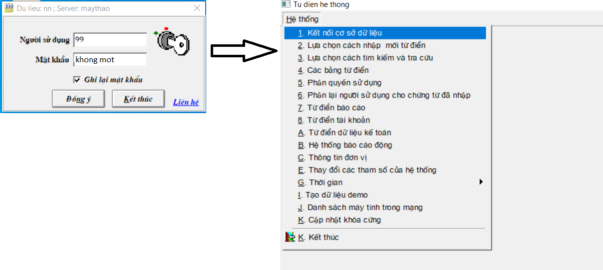
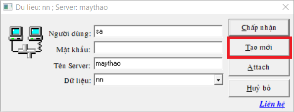

# Phục hồi dữ liệu cũ

## Bước 1:

Đăng nhập vào chương trình với : **người sử dụng: 99, mật khẩu: khong mot** -&gt; đồng ý

Chọn **Hệ thống -&gt; 1. Kết nối cơ sở dữ liệu**

                                          

## Bước 2:

Sau khi hiện bảng này chọn Tạo Mới

Sau khi chọn **TẠO MỚI** sẽ hiện ra bảng sau:

* Điền file nguồn chứa dữ liệu vào ô Từ file nén \(rar,zip...\) 
* Điền tên dữ liệu vào ô Dữ liệu. 

Thao tác như hình dưới đây. -&gt; Điền xong bấm **Thực hiện** 

## Bước 3:

Sau khi phần mềm báo đã **phục hồi thành công** 

Ta vào lại **Hệ thống -&gt; A. Từ điển dữ liệu kế toán**

Điền mật khẩu: **khong mot**

Sau khi lỗi dữ liệu ra bấm **THOÁT**, chương trình sẽ hỏi Có đồng ý ghi lại các thay đổi không? -&gt; bấm CÓ 

