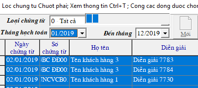

# Sao chép số liệu sang dữ liệu khác

## Bước 1: Vào Menu Tiện ích

Vào menu **TIỆN ÍCH -> 5. Sao chép số liệu sang cơ sở dữ liệu khác**

Tại đây có các mục để chọn. Ví dụ muốn copy **CHỨNG TỪ KẾ TOÁN** thì chọn mục 1.

##  **Bước 2: Chọn chứng từ muốn copy**

Sau khi chọn mục cần thiết, Ví dụ chọn mục **1. Copy chứng từ kế toán,** sẽ hiện bảng lọc chứng từ như sau:

* Tích vào ô **Cho lọc từ tháng đến tháng**
* Giữ phím **Shift** chọn từ dòng đến dòng cần copy \(giống với chọn trong excel\); Hoặc giữ **Ctrl** chọn từng dòng lẻ muốn copy.

## Bước 3: Copy Paste

Sau khi bôi xanh các dòng, bấm nút **COPY, rồi bấm PASTE** \(bên cạnh\):

* **Ô tên Server:** là tên của máy chủ, nếu đấy là máy chủ thì điền là **\(local\)**
* **Ô Dữ liệu:** điền ****tên của dữ liệu muốn copy đến vào 
* Nếu có thêm mã công nợ mới, bấm tích vào ô **Khi copy dữ liệu thì copy luôn từ điển**

Điền và chọn đủ thông tin bấm **CHẤP NHẬN** để chạy, sẽ thấy 1 dòng chạy như thế này ở phần Loại chứng từ phía trên góc trái màn hình, sau khi chạy xong chương trình sẽ báo **ĐÃ COPY XONG**

