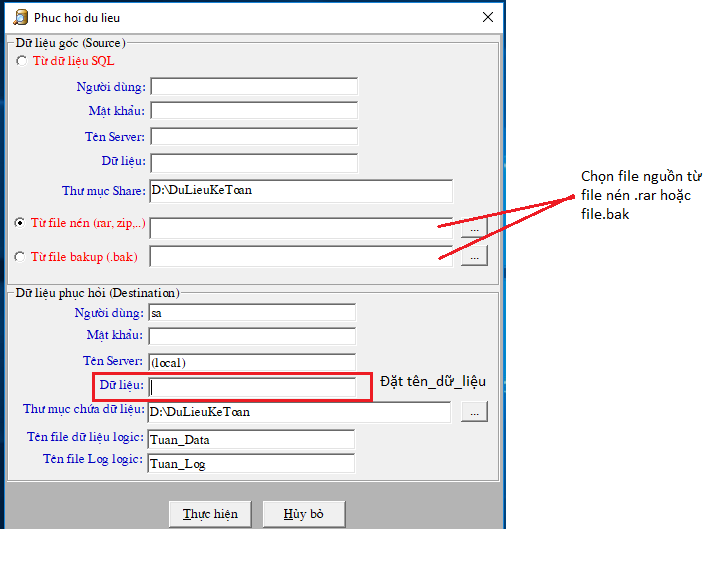
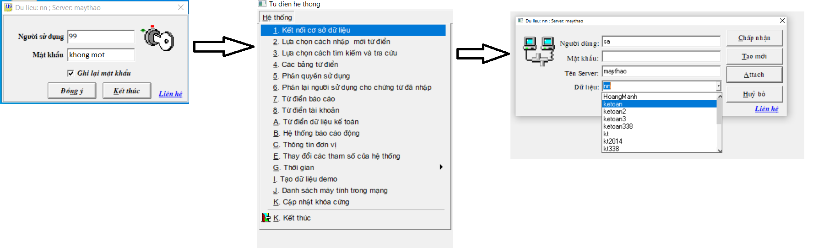
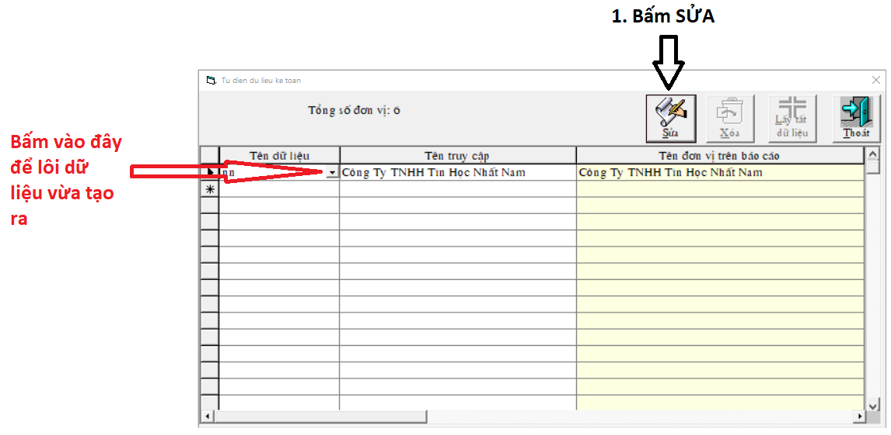

# Tạo dữ liệu mới

## **Bước 1: Tạo dữ liệu** 

* Ta chuột phải vào biểu tượng kế toán ngoài desktop -&gt; chọn open file location -&gt; Chuột phải vào Restore -&gt; sent to desktop
* Kích đúp vào biểu tượng restore -&gt; chọn kiểu tệp
* Sẽ có 2 kiểu định dạng chứa dữ liệu: 1 là kiểu nén file.rar, 2 là kiểu file.bak \(hình ảnh minh họa\). dữ liệu ở định dạng nào thì ta chọn đối chiếu đến đó.
* Thông thường trong bộ cài đặt kế toán có để file **ketoan.rar** để tạo dữ liệu mới, ta chọn ketoan.rar
* Đặt tên cho dữ liệu
* Sau đó ấn Thực hiện và đợi hệ thống chạy xong. 

## Bước 2: Thay đổi thông tin công ty

* Ta đăng nhập với tên người sử dụng: 99; pass: khong mot \( "khong" dấu cách chữ "mot"\)
* Chọn Hệ thống -&gt; 1. Kết nối cơ sở dữ liệu -&gt; Chọn dữ liệu vừa tạo mới và bấm Chập nhận

* Sau khi chọn dữ liệu xong -&gt; Hệ thống -&gt; C. Thông tin đơn vị -&gt; bấm SỬA và điền thông tin của công ty 
* Điền xong bấm **CHẤP NHẬN và thoát**

## Bước 3: Lấy dữ liệu vừa tạo

* Hệ thống -&gt; A. Từ điển hệ thống -&gt; Điền mật khẩu: khong mot
* Sau khi lỗi dữ liệu ra bấm THOÁT, chương trình sẽ hỏi Có đồng ý ghi lại các thay đổi không? -&gt; bấm CÓ

## \*\*\*\*

