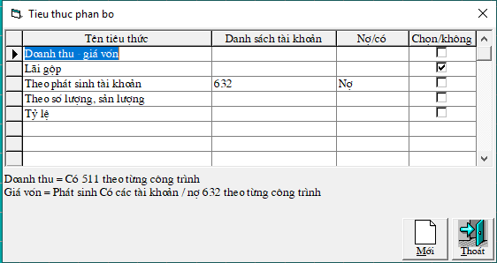

# Kết chuyển và Phân bổ tài khoản

## KẾT CHUYỂN:

Kết chuyển bằng tay: Hạch toán trực tiếp chứng từ kết chuyển

Kết chuyển tự động: Kế toán viên muốn kết chuyển tự động tài khoản nào, đến cuối kỳ, phần mềm sẽ tự động tạo ra các chứng từ kết chuyển cho tài khoản đó.

Kết chuyển bán tự động \(hỗ trợ kết chuyển\): Phần mềm sẽ đưa ra toàn bộ số liệu DỰ ĐỊNH KẾT CHUYỂN, sau đó tùy vào kế toán viên sẽ lựa chọn cần kết chuyển bao nhiêu để điều chỉnh số liệu kết chuyển theo ý muốn.

### **I. Kết chuyển tài khoản:** 

Sử dụng cho các tài khoản không mở chi tiết. Ví dụ có 641, 642, 811,821 sang nợ 911 hoặc nợ 711 sang có 911 ….

Vào **TÍNH TOÁN -&gt; KẾT CHUYỂN TÀI KHOẢN** -&gt; chọn thời gian kết chuyển, chọn tài khoản kết chuyển -&gt; bấm Kết chuyển -&gt; Lưu kết quả **sẽ tạo ra giá trị được kết chuyển ở cột Kết chuyển mới = Dư đầu kỳ + Phát sinh trong kỳ.**

**Muốn sửa Từ điển tài khoản kết chuyển: bấm vào nút “Sửa Tài khoản”**

Bấm nút **Sửa,** nếu ****muốn thêm bút toán thì bắt đầu thêm vào dòng cuối cùng \(có dấu \* ở đầu\), bao gồm các thông tin:

**Số thứ tự**: chú ý đến số thứ tự của kết chuyển, kết chuyển nào thực hiện trước thì có số thứ tự nhỏ hơn \(ví dụ như kết chuyển lãi/lỗ phải để cuối cùng\).

**Cột** **Nợ/Có**: nghĩa là sẽ kết chuyển từ bên nợ hay có của tài khoản kết chuyển đi sang bên Nợ hay Cợ của tài khoản kết chuyển đến. 

Cột tài khoản đi: là tài khoản được kết chuyển đi. ví dụ có 642/nợ 911 thì cột này là 642. Cột này có thể chọn tài khoản mẹ, thì khi kết chuyển sẽ lấy danh sách các tài khoản con.

Cột tài khoản đến: là tài khoản được kết chuyển đến. ví dụ có 642/nợ 911 thì cột này là 911. Cột này phải chọn tài khoản con.

Diễn giải kết chuyển: nếu để trắng thì máy sẽ tự điền là kết chuyển nợ/có Tk1 sang có/nợ Tk2 \(thường là để trắng\). Còn nếu kế toán muốn diễn giải thế nào thì gõ vào.

### 
 **II. Kết chuyển Công trình, hợp đồng**

Là các kết chuyển cho những Tài khoản có mở chi tiết theo dõi Công trình: Thường là Tài khoản 154, 621, 622, 627, 632, 511 ...

Vào **TÍNH TOÁN** -&gt; **KẾT CHUYỂN CÔNG TRÌNH, HỢP ĐỒNG** 

Giao diện như sau: sử dụng các Tab lựa chọn tuỳ theo tính chất tài khoản

**Tab 1. Kết chuyển thẳng:**

**\(+\)** Cho các tài khoản có mở theo dõi công trình: Thường là có 621,622,623, 627 sang nợ 154 hoặc Có 154 sang Nợ 632. Kết chuyển các công trình từ tài khoản này sang công trình của tài khoản khác. Bấm nút lệnh **Kết chuyển** thì giá trị được kết chuyển lưu vào cột "**Kết chuyển mới**". Giá trị này có thể điều chỉnh trực tiếp. Muốn lưu kết quả của cột "Kết chuyển mới" nhấn vào nút " Lưu kết quả" và máy sẽ tạo một chứng từ của kết chuyển này vào tháng hạch toán là "Đến tháng". Khi làm kết chuyển thì các kết chuyển cũ \(trong thời gian từ tháng -&gt; đến tháng sẽ bị xóa\).

**\(+\)** Các dòng nào có dấu tích sẽ được kết chuyển.

**\(+\)** Muốn thêm tài khoản kết chuyển nào thì vào danh sách bấm **"Sửa Tài khoản"**. Nếu trong danh sách tài khoản mà không có tài khoản muốn kết chuyển thì vào **bấm nút Thêm** và thêm cặp tài khoản cần kết chuyển.

**Tab 4. Kết chuyển công trình tài khoản:** Là kết chuyển các phát sinh của tài khoản có mở theo dõi công trình sang tài khoản không theo dõi công trình.

Ví dụ: Có 632 sang nợ 911 hoặc nợ 511 sang có 911 \(vì 911 không mở chi tiết\)

+ Nếu muốn tự động/không tự động kết chuyển các tài khoản, bấm nút “Sửa tài khoản” trong bảng chọn tài khoản, sau đó bấm tiếp nút “Thêm tài khoản”. Trong bảng này tích/không tích vào cột “Tự động kết chuyển” của tài khoản đó.

_**Chú ý: tài khoản 154 do số dư còn để lại vì thế không nên kết chuyển tự động tài khoản này.**_

## PHÂN BỔ:

### **I. Phân bổ tài khoản - công trình**

Vào **TÍNH TOÁN** -&gt; **KẾT CHUYỂN CÔNG TRÌNH, HỢP ĐỒNG** -&gt; chọn tab **2**. **Phân bổ tài khoản công trình:**

Phân bổ các tài khoản không mở chi tiết công trình sang tài khoản có mở chi tiết công trình. Ví dụ 6274 sang 154 hoặc phân bổ chi phí quản lý trong biểu phân tích giá thành có 642 sang Nợ 911.

Có 5 tiêu thức phân bổ là: **Doanh thu - giá vốn, Lãi gộp, Theo phát sinh tài khoản, Theo số lượng hoặc sản lượng, Tỷ lệ.**  Khi ta bấm và dòng Tiêu thức phân bổ màu xanh ngoài màn hình của Phân bổ Tài  khoản công trình, thì giao diện sau xuất hiện:

Khi chọn Tiêu thức phân bổ nào thì các thông tin liên quan sẽ được hiện ở dưới giao diện.

### **II. Phân bổ công trình công trình:**

Vào **TÍNH TOÁN** -&gt; **KẾT CHUYỂN CÔNG TRÌNH, HỢP ĐỒNG** -&gt; chọn tab **2**. **Phân bổ tài khoản công trình:**

Nếu đơn vị tạo ra các đối tượng để tập hợp các chi phí chung vào những đối tượng này. Sau đó từ đối tượng này phân bổ cho các đối tượng khác. Ví dụ: Chi phí chung của công ty abc.

Để tạo công trình chung phân bổ vào **"Hệ thống"-&gt; " Từ điển hệ thống"** **-&gt; Từ điển công trình** **-&gt; bấm Thêm** Trong bảng Sửa bấm tích vào " **Phân bổ công trình":**

Do đặc thù của từng đơn vị, kế toán viên luôn muốn việc hạch toán chi phí được thực hiện trực tiếp vào các công trình - hợp đồng cụ thể. Nhưng có những chi phí vẫn không thể hạch toán trực tiếp được mà phải hạch toán vào 1 đầu mục CHUNG, sau đó từ đầu mục CHUNG mới PHÂN BỔ cho những đầu mục khác.  
👍 Phần mềm kế toán Nhất Nam có thể xử lý mọi tình huống PHÂN BỔ, với đầy đủ các tiêu thức phân bổ để kế toán viên lựa chọn cho phù hợp với công việc của mình như: Lãi gộp, phát sinh theo tài khoản, số lương - sản lượng, tỷ lệ...

