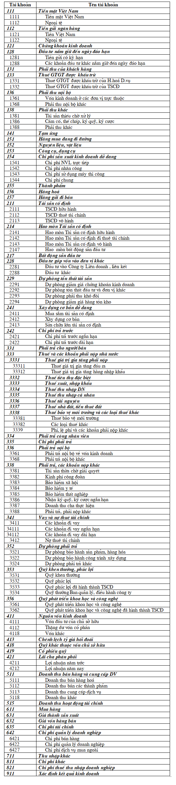

# Kế toán là gì? Hạch toán kế toán là gì? Thông tư 133 có gì khác?

### **I. Kế toán là gì?**

Là bộ phận quan trọng của hệ thống quản lý kinh tế, tài chính, có vai trò tích cực trong quản lý, điều hành và kiểm soát các hoạt động kinh tế, tài chính của Nhà nước và tài chính doanh nghiệp.

### **II. Hạch toán kế toán là gì?**

Là việc ghi chép, tính toán các giao dịch của một doanh nghiệp vào sổ kế toán. Là việc định khoản Nợ/Có các chứng từ kế toán như: hóa đơn… thành các bút toán.

### **III. Các loại sổ kế toán**

**Nhật ký chung là sổ kế toán tổng hợp:**

* Ghi chép các nghiệp vụ kinh tế phát sinh theo trình tự thời gian
* Đồng thời phản ánh theo quan hệ đối ứng tài khoản để phục vụ cho việc ghi sổ cái.
* Số liệu ghi trên Nhật ký chung dùng làm căn cứ ghi vào Sổ cái

**Nhật ký - sổ cái là sổ kế toán tổng hợp \(theo hình thức nhật ký – sổ cái\):**

* Phản ánh tất cả các nghiệp vụ phát sinh theo trình tự thời gian và hệ thống hóa theo nội dung kinh tế
* Số liệu ghi trên Nhật ký - Sổ cái dùng để lập báo cáo tài chính.

**Chứng từ ghi sổ là sổ kế toán tổng hợp \(theo hình thức Chứng từ ghi sổ\):**

* Ghi chép các nghiệp vụ phát sinh theo trình tự thời gian
* Sổ này dùng để đăng ký các nghiệp vụ phát sinh, quản lý chứng từ ghi sổ
* Kiểm tra, đối chiếu số liệu với Bảng cân đối phát sinh.

**Ngoài ra còn có: Sổ quỹ tiền mặt, sổ chi tiết tiền mặt, sổ tiền gửi ngân hàng….**

* Sổ quỹ tiền mặt: dùng cho thủ quỹ, phản ánh tình hình thu chi tồn tiền mặt
* Sổ chi tiết tiền mặt: dùng cho kế toán viên, phản ánh tình hình thu chi tồn tiền mặt và có cột tài khoản đối ứng
* Sổ tiền gửi ngân hàng: theo dõi chi tiết tiền của doanh nghiệp gửi tại Ngân hàng.

### **IV. Thông tư 133 có gì khác với quyết định 48**

#### **Bảng từ điển tài khoản theo Thông tư 133**

