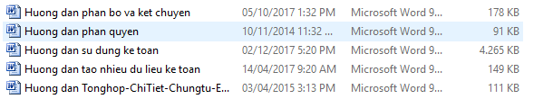

# Tải bản hướng dẫn dạng .doc

## CÁCH ĐỌC HƯỚNG DẪN TRÊN WEB

Ta vào web: [https://phanmemnhatnam.com/](https://phanmemnhatnam.com/) chọn tab Hướng dẫn sử dụng

Hoặc vào theo link sau: [https://docs.phanmemnhatnam.com/](https://docs.phanmemnhatnam.com/)

### Màn hình bên trái

Gồm các phần hướng dẫn cụ thể ở màn hình phía bên trái, ta lăn chuột xuống sẽ thấy lần lượt các hướng dẫn như sau:

1. Hướng dẫn cài đặt
2. Hướng dẫn Nhập
3. Hướng dẫn nhập cho đơn vị giao thông vận tải
4. Hướng dẫn sử dụng menu Tiện ích

Chọn xem hướng dẫn chỉ cần tích vào, sẽ hiện ra phần hướng dẫn ở khung màn hình giữa.

### Màn hình giữa

Hiển thị nội dung hướng dẫn, bao gồm cả chữ và hình ảnh.

### Màn hình bên phải

Bao gồm có **SEARCH**: để tìm kiếm nhanh, chỉ cần đánh 1 từ khóa vào và bấm enter

Ở dưới có CONTENTS: mục lục các phần có trong hướng dẫn đó, muốn xem nhanh đến phần nào chỉ cần kích chuột vào chữ đó.

## CÁCH TẢI VÀ ĐỌC HƯỚNG DẪN DẠNG .DOC

Ta vào đường link sau để tải: [https://www.mediafire.com/file/vom5l5i447dajwy/Huongdan.rar/file](https://www.mediafire.com/file/vom5l5i447dajwy/Huongdan.rar/file)

Sau tải tải về, ta giải nén sẽ có những file.doc sau:

File **HƯỚNG DẪN SỬ DỤNG KẾ TOÁN** là file gồm đầy đủ tất cả hướng dẫn chi tiết từ A-&gt;Z do tác giả phần mềm viết ra. 

Những file.doc khác là được bóc tách từ file đầy đủ: như **Hướng dẫn phân bổ và kết chuyển, hướng dẫn phân quyền, hướng dẫn tạo nhiều dữ liệu kế toán** đều là những phần có nhiều khách hàng quan tâm, nên được bóc tách ra để dễ theo dõi

